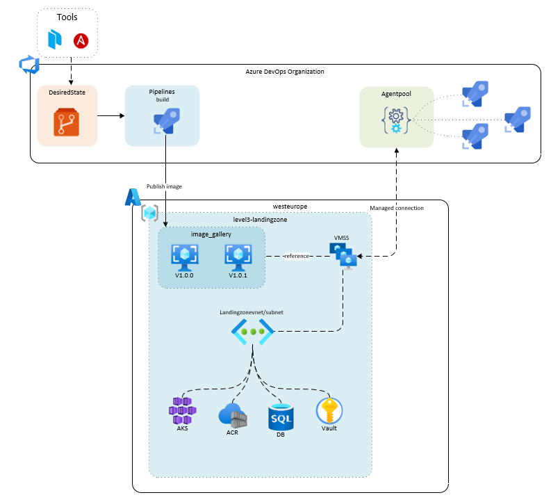

# Desired state image building and publishing
Create a VM image and publish it to a image gallery from a single file

```
 _______________________________
< Desired state managed images! >
 -------------------------------
        \   ^__^
         \  (oo)\_______
            (__)\       )\/\
                ||----w |
                ||     ||
```
# Architecture

# Features

* Bootstrap packer and ansible from a single desired state
* Automated building of images and publishing
* Supports Windows and Ubuntu images
* Data as Config driven (DaC)

# Tooling

Developed with the following tool versions

* Ansible version 2.9.97
* Packer version 1.8.0
* Python version 3.10.0


# Create VMSS
After an image has been published to the compute gallery you can create an VMSS from it. Make sure that the following settings are used
* Add VMSS to the correct VNET/subnet
* Autoscaling settings must be set to "manual" if you want to use VMSS as a self-hosted DevOps agent

# How does it work?

1. Everything from the desired_state.yaml file
2. This file is converted by `templater.py` to Hasicorp Packer HCL templates for IaC image provisioning + Ansible playbook for OS level Config-as-Code
3. CI pipeline runs everything in sequence

# How to use

**Manually**
1. Update `desired_settings.yaml` 
2. Run templater.py (this will create 3 files; `scripts/pre-processor-img.sh`, `build_config/playbook.yaml` & `builds/azure-vmss.pkr.hcl`)
3. Execute `scripts/pre-processor-img.sh` with bash (this will create an image definition in the compute gallery specified in `desired_settings.yaml` )
4. Run the `builds/azure-vmss.pkr.hcl` file with packer

**From CI**
1. Create a pipeline from the ci/azure-pipelines.yaml file
2. Change the `service_connection` variable value to an existing service connection
3. Update Update `desired_settings.yaml`
4. e voilà 


# TODO

* Create reference docs for desired_state.yaml

# Important links

1. Creating VMSS based self hosted Azure DevOps agents: https://docs.microsoft.com/en-us/azure/devops/pipelines/agents/scale-set-agents?view=azure-devops


